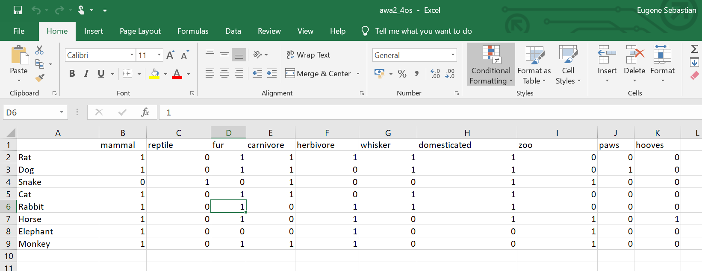
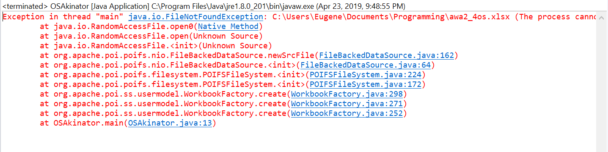
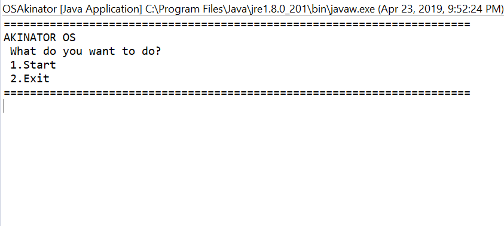
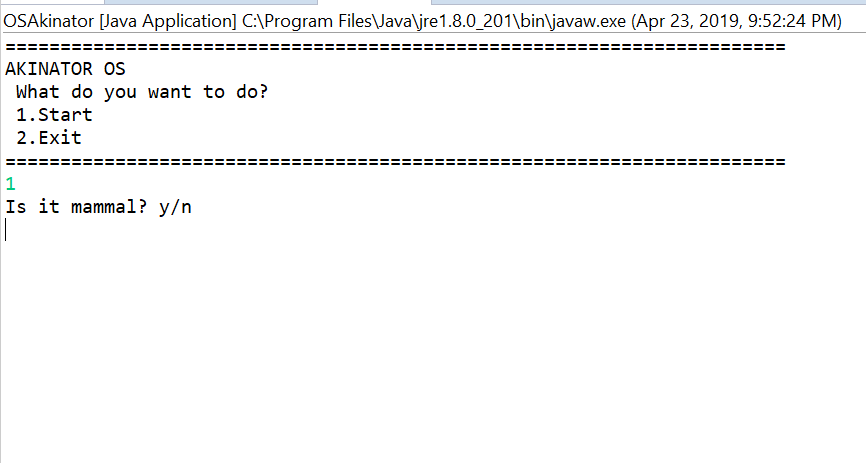
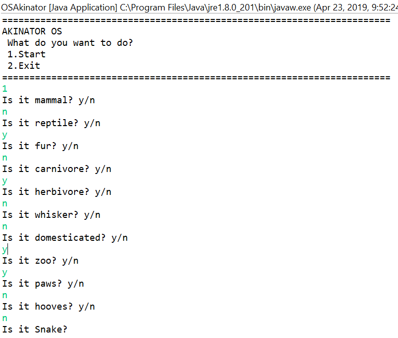

# Akinator-OS
## Introduction
OSAkinator is a java program that reads data from an excel file which has both an entity and attributes associated with it.
When executing the program, it will ask various questions regarding the attributes and should it match one of the entities it will tell 
the user about it.
## Requirements
- [java](https://www.java.com/en/download/)
- [apache-poi](https://poi.apache.org/)

In my case I used [eclipse](https://www.eclipse.org/), an IDE that specializes in writing programs in java language it also makes using apache poi much easier.


Details of adding the apache-poi library [into your java class](https://www.youtube.com/watch?v=w757wjTiruU)

## Syntax of the program
```
public static final String SAMPLE_XLSX_FILE_PATH = "C:/Users/Eugene/Documents/Programming/awa2_4os.xlsx";
```
This syntax is used to use the excel file which in my case was awa2_4os which was found under that directory.


This is the layer database
```
ArrayList<String> attributes = new ArrayList<String>();
ArrayList<String> entities = new ArrayList<String>();
ArrayList<ArrayList<Integer> > attributeMapping = new ArrayList<ArrayList<Integer> >(); 
```  
The function uses three array lists where one of them is a dimensional variant. This is used as a mapping to store each and every attributes of all the entities.
```
for (Row row : sheet) {
        	attributeMapping.add(new ArrayList<Integer>());
	                for (Cell cell : row) {
	                	if ( i == 0) {
	                	String value = cell.getStringCellValue();
	                	attributes.add(value);
	                	}
	                	else {
	                		try {
	                			if ( j == 0) {
	                				String value = cell.getStringCellValue();
	                				entities.add(value);
	                				j=1;
	                			}
	                			else {
	                				int value = (int) cell.getNumericCellValue();
	                				 attributeMapping.get(k).add(value);
	                				 if (value != 1 && value != 0) {
	                					 attributeMapping.remove(k);
	                					 break;
	                				 }
	                			}
	                		}
	                		catch(Exception e){
	                			break;
	                		}
	                	}
	                }
	                j = 0;
	                i = 1;
	                k++;
        }
```
The purpose of this function is to add all of the data into arraylists, I did so because I am not fairly familiar with the syntax of iterating cell by cell

```
for(i=0;i<attributes.size();i++) {
	        		System.out.println("Is it " + attributes.get(i) +"? y/n");
	        		char ans = input.next().charAt(0);
	        		if (ans=='y') {
	        			response.add(1);
	        		}
	        		else {
	        			response.add(0);
	        		}
	        	}
```
This is done to add the attribute data the user requests to an arraylist called response a part of the layer processing
```
for (i=0;i<entities.size();i++) {
		        	count = 0;
		        	for (j=0;j<attributes.size();j++) {
		        		if (attributeMapping.get(i).get(j)==response.get(j)) {
		        			count++;
		        		}
		        	}
		        	if (count ==attributes.size()) {
			        	System.out.println("Is it " + entities.get(i)+ "?");
			        	count = -1;
			        	break;
			        }
		        }
```
This is where the response arraylist is being compared with each and every entity's attributes to look for a match also a part of
the layer processing

## Running the program


Note: When trying to execute the program always make sure to close the excel file or it will cause an error like in the picture 



When running the program will ask various questions and you either type y for yes or n for no


When you get a match the program will tell you in this case I got snake
